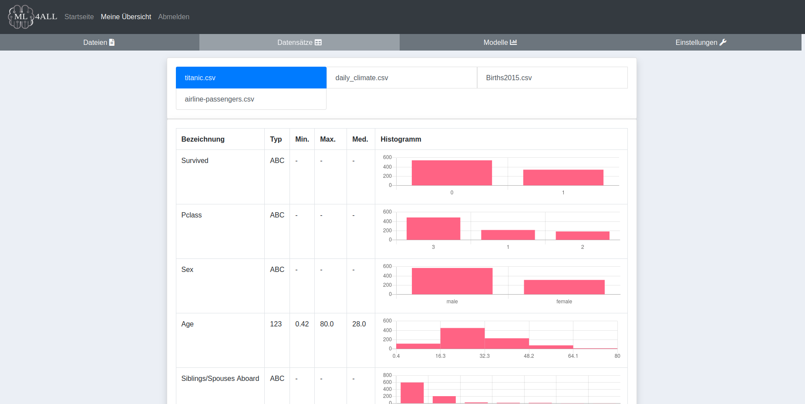
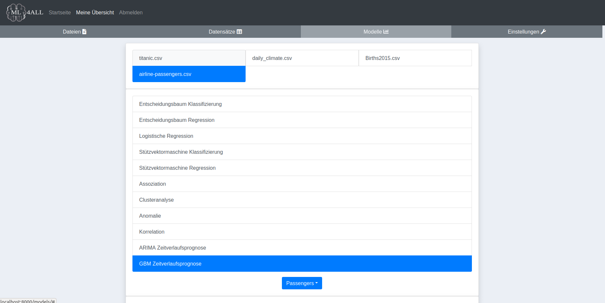
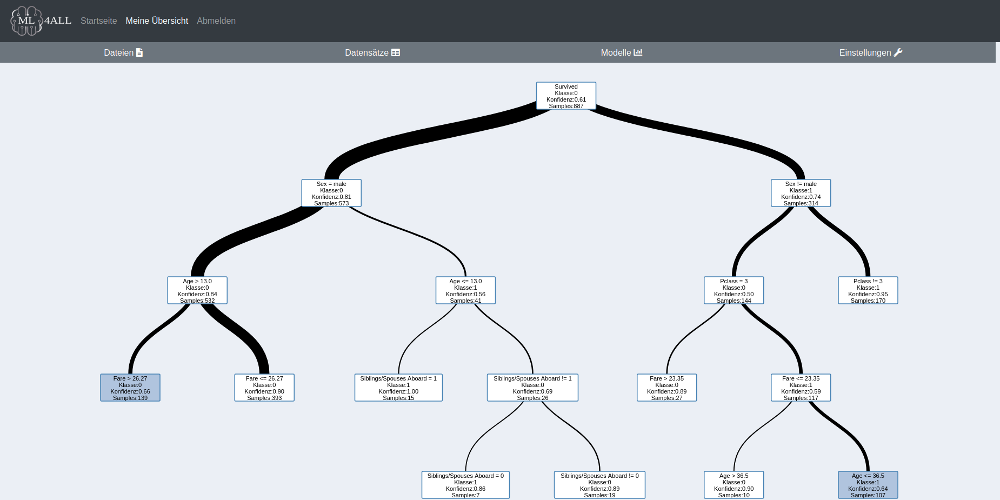
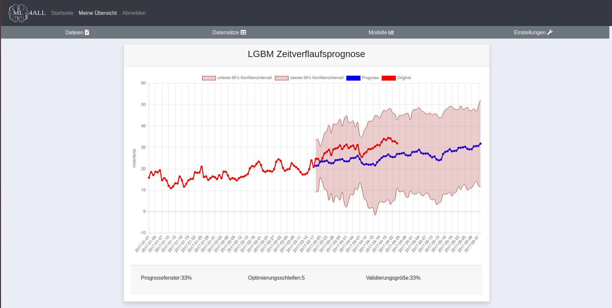
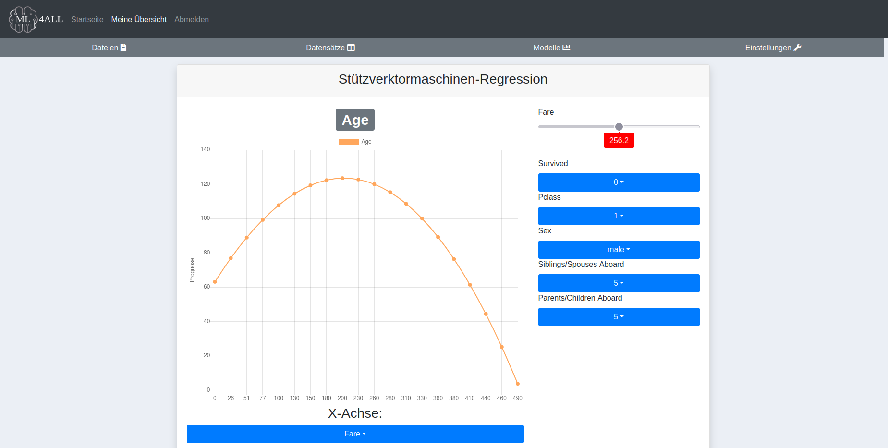

# ML4ALL: Machine-Learning für Jedermann

Bei *ML4ALL* handelt es sich um eine Webapp, die auf dem Django-Framework aufbaut.
Der Zweck der Applikation besteht darin, jedem zu ermöglichen auf eine möglichst intuitive Art und Weise seine eigenen Daten mit Hilfe von Machine-Learning Modellen zu analysieren um datengestützte Entscheidungsfindung zu erleichtern.

Die zu analysierenden Daten können in den Formaten *xls*,*csv* oder auch *odf* bereitgestellt werden.

Zu den momentan implementierten Modellen zählen:
- *Decision Tree*-Klassifizierung
- *Decision Tree*-Regression
- *Logistische Regression*
- *Support Vector Machine*-Klassifizierung
- *Support Vector-Machine*-Regression
- *Assoziationsanalyse*
- *Clusteranalyse*
- *Anomalie-Detektion*
- *Korrelations-Analyse*
- *ARIMA*-Zeitverlaufsprognose
- *Gradient Boosting Machine*-Zeitverlaufsprognose 

Zudem besteht die Möglichkeit das Verhalten der Modelle durch Anpassen der Modellparameter in einem gewissen Rahmen zu steuern. Ferner ermöglichen einige Modelle eine automatisierte Parameteroptimierung und garantieren so das Beste aus den Daten herauszuholen.

Darüber hinaus geben verschiedene Metriken Aufschluss über die Plausibilität und statistische Signifikanz der Ergebnisse, z.B. in Form einer sog. *Confusion Matrix* eines *Konfidenzintervalls*, einer Aufschlüsselung der Einflussfaktoren, der Varianz, des Bestimmtheitsmaßes usw. 

Die folgenden Schnappschüsse liefern einen ersten Eindruck der Benutzeroberfläche.






# Installation
Die Installation der Applikation gestaltet sich dank Docker denkbar einfach.
In einem ersten Schritt muss zunächst ein *Dockerimage* aus dem mitgelieferten *Dockerfile* erstellt werden.
Dazu muss lediglich der folgende Befehlt ausgeführt werden.
```Shell
	docker build -t ml4all .
```
Sobald alle *python-dependenices* installiert wurden, muss in einem zweiten Schritt noch ein entsprechender Container gestartet werden:
```Shell
	docker run ml4all -p 8000:8000
```
Damit wird automatisch eine *SQLite*-Datenbank samt Adminuser angelegt, der Entwicklungsserver gestartet und schon steht die Anwendung bereit.

# Benutzung

Nach erfolgreicher Installation, steht die Anwendung im Browser unter der Adresse *http://localhost:8000* bereit.
**Achtung**: Es kann es vorkommen, dass das Portforwarding nicht funktioniert und die Applikation nicht unter *localhost* erreichbar ist.
In diesem Fall muss anstelle von *localhost* die IP-Adresse des Dockercontainers im Browser angegeben werden, z.B. *172.0.1.2:8000*.
Die IP des Containers lässt sich per *docker inspect* ausfindig machen.

Beim ersten Aufrufen der Applikation im Browser gelangt man zunächst zur Startseite.
Ganz unten, im Abschnitt *Beispiel-Datensätze*, hat man die Möglichkeit die mitgelieferten Demodaten herunterzuladen.

Durch Klick auf die Schaltfläche *Anmelden* oben in der Toolbar wird man weitergeleitet zur Anmeldemaske.
Der Benutzername und das Passwort für den automatisch angelegten Adminuser lauten beide *admin*.

Nach erfolgter Anmeldung landet man im persönlichen Dashboard.
Das Dashboard gliedert sich in vier Abschnitte:
- Dateien: Hier werden die, zu analysierenden Daten im Tabellenformat (*xls*,*csv* oder *odf* ) hochgeladen.
- Datensätze: Dieser Abschnitt liefert eine Zusammenfassung der hochgeladenen Daten in Form von Histogrammen
- Einstellungen: In dieser Übersicht hat man die Möglichkeit die verwendeten Modellparameter anzupassen
- Modelle: Diese Ansicht entspricht dem eigentlichen Arbeitsbereich der Anwendung. Das Vorgehen bei der Analyse der Daten ist immer dasselbe:
	1. Im oberen Teilbereich ist zunächst der zu analysierende Datensatz zu markieren. Es kann immer nur ein Datensatz selektiert werden.
	2. Darunter definiert man das Modell, mit dem man seinen Datensatz analysieren möchte.
	3. Hat man sich für ein Modell entschieden, muss im Dropdown-Menü *Zielgröße wählen*, das Datenfeld selektiert werden, welches in Abhängigkeit aller anderen Datenfelder vom jeweiligen Algorithmus betrachtet/vorhergesagt werden soll. Bei einigen der Modelle können keine individuellen Zielgrößen festgelegt werden (z.B. Clusteranalyse). In diesen Fällen steht hier nur *Alle* zu Auswahl. Handelt es sich beim selektierten Modell um eine Zeitverlaufsprognose, erkennt die Applikation automatisch das Feld, welches die zeitliche Achse repräsentiert. Dieses Feld steht daher nicht als Zielgröße zur Auswahl. Enthält der Datensatz mehrere Felder, die eine Zeitangabe enthalten, wird automatisch das erste Feld gewählt, das als solches identifiziert wurde.
	4. Ein Klick auf die Schaltfläche *Analyse hinzufügen* startet die Berechnung
	5. Nachdem die Analyse abgeschlossen ist, wird ein neuer Eintrag im untersten Abschnitt *Ergebnisse* hinzugefügt.
	6. Ein Klick auf den Link in der Spalte *Datensatz* in der Ergebnistabelle leitet uns zur Visualisierung der Ergebnisse weiter.
	

# Konfiguration

Da dieses Repository darauf ausgelegt ist, ein möglichst schnelles Aufsetzen und Testen dieser Webapp zu gewährleisten sind einige der Konfigurationen teils unvollständig bzw. nicht optimal für ein produktives Deployment.

Allem voran müsste ein Webserver konfiguriert werden, damit das eingebaute Usermanagement inkl. Registrierung, Bestätigungsmail etc. auch wirklich funktioniert. 
Die entsprechenden Einstellungen müssen in der Datei `app/settings.py` ergänzt werden:
```Python
EMAIL_BACKEND = 'django.core.mail.backends.smtp.EmailBackend'
EMAIL_HOST = ""
EMAIL_PORT = 587
EMAIL_HOST_USER = ''
EMAIL_HOST_PASSWORD = ""
EMAIL_FROM = ""
DEFAULT_FROM_EMAIL = ""
EMAIL_USE_TLS = True
```


Zu den weiteren Variablen, die in `settings.py` für ein Deployment in eine Produktivumgebung angepasst werden müssen zählen *ALLOWED_HOSTS* sowie *SECRET_KEY* und *DEBUG*
1. ALLOWED_HOSTS
	- In der Produktionsumgebung sollten immer nur die zugelassenen Hostnamen angegeben werden, die auf Ihre Django-Anwendung zugreifen dürfen. Diese Einstellung hilft potenzielle Sicherheitsrisiken wie HTTP Host-Header-Angriffe und DNS-Rebinding-Angriffe zu verhindern.	    
	- Setzen Sie ALLOWED_HOSTS auf eine Liste gültiger Domainnamen oder IP-Adressen, die auf Ihre Anwendung zugreifen dürfen. Zum Beispiel:
	```Python
	ALLOWED_HOSTS = ['your_domain.com', 'www.your_domain.com', 'your_server_ip']
	```
	- Wenn Sie einen Reverse-Proxy wie Nginx oder Apache vor Ihrer Django-Anwendung verwenden, stellen Sie sicher, dass der Hostname oder die IP-Adresse des Reverse-Proxy in der ALLOWED_HOSTS-Liste enthalten ist.	
2. SECRET_KEY
	- Der SECRET_KEY ist eine kritische Sicherheitseinstellung, die in Django für kryptografische Signierung und Sicherung von Sitzungen, Cookies und anderen sicherheitsrelevanten Funktionen verwendet wird  
	- Behalten Sie den SECRET_KEY vertraulich und teilen Sie ihn nicht öffentlich oder binden ihn in die Versionskontrolle mit ein. 
	- Verwenden Sie stattdessen Umgebungsvariablen oder ein sicheres System zur Verwaltung von Geheimnissen, um den SECRET_KEY zu setzen.
	- In der Produktionsumgebung vermeiden Sie das direkte Hardcoden des SECRET_KEY in der settings.py-Datei. 
	- Stattdessen können Sie ihn aus einer Umgebungsvariable abrufen. Zum Beispiel
	```Python
	import os
	
	SECRET_KEY = os.environ.get('DJANGO_SECRET_KEY')
	```
3. DEBUG
	- In der Produktionsumgebung stellen Sie immer sicher, dass `DEBUG` in Ihrer settings.py auf `False` gesetzt ist. 
	- Das Aktivieren von `DEBUG` in der Produktionsumgebung könnte sensible Informationen offenlegen und Sicherheitsrisiken verursachen.

Ferner sind die Themen SSL und das Bereitstellen von statischen- und Media-Dateien zu beachten:
4.  TTPS und SSL/TLS:    
    - Für eine sichere Kommunikation zwischen Ihren Benutzern und dem Server aktivieren Sie HTTPS, indem Sie ein SSL/TLS-Zertifikat auf Ihrem Server installieren. Dies gewährleistet eine verschlüsselte Datenübertragung und schützt sensible Informationen, wie Passwörter.
    - Verwenden Sie Tools wie Certbot, um SSL-Zertifikate zu erhalten und zu verwalten.
5. . Statische und Mediendateien:    
    - In der Produktionsumgebung sollten statische und Mediendateien über einen Webserver wie Nginx oder Apache ausgeliefert werden. Verlassen Sie sich nicht auf den integrierten Entwicklungsserver von Django, um statische Dateien bereitzustellen.


Auch der Entwicklungsserver selber ist problematisch, da er zum einen nicht für den Umgang mit einer größeren Zahl an Anfragen und Benutzern ausgelegt ist und darüber hinaus nicht alle Funktionen und Optionen, wie z.B. SSL/TLS-Unterstützung bietet.

Um den internen Entwicklungsserver von Django, der normalerweise mit dem Befehl "python manage.py runserver" gestartet wird, durch einen für die Produktion geeigneten Server zu ersetzen, verwenden Sie in der Regel einen Produktions-Webserver wie Gunicorn oder uWSGI. 
Diese Webserver sind für die Anforderungen einer Produktionsumgebung konzipiert und verbessern die Leistung und Skalierbarkeit.

So können Sie den Entwicklungsserver durch Gunicorn oder uWSGI ersetzen:

1. **Installieren des Produktions-Servers**: Zunächst müssen Sie den Produktions-Server Ihrer Wahl installieren (Gunicorn oder uWSGI). Dies können Sie mit dem Python-Paketmanager "pip" tun.    
    Für Gunicorn:    
	```Python 
	pip install gunicorn
	```

	Für uWSGI:
	```Python
	pip install uwsgi`
	```
    
2. **Aktualisieren der Django-Einstellungen**: In den Einstellungen Ihres Django-Projekts (settings.py) fügen Sie die Host- und Port-Konfigurationen für den Produktions-Server hinzu.```python
```Python
	ALLOWED_HOSTS = ['ihre_domain_oder_ip']`
```
    
3. **Starten des Produktions-Servers** 
	- Nun können Sie den Produktions-Server mit dem installierten Paket (Gunicorn oder uWSGI) starten. Öffnen Sie ein Terminal, navigieren Sie zum Hauptverzeichnis Ihres Django-Projekts (wo sich manage.py befindet), und verwenden Sie einen der folgenden Befehle:    
	- Für Gunicorn:
	```Python 
	gunicorn your_project_name.wsgi:application`
	```

	* Für uWSGI:
	```Python
	uwsgi --http :8000 --module your_project_name.wsgi`
	```
    
    Ersetzen Sie 'your_project_name' durch den Namen Ihres Django-Projekts. Die obigen Befehle starten den Produktions-Server auf Port 8000, aber Sie können die Portnummer nach Bedarf ändern.
    
4. **Reverse Proxy (Optional)**: Es wird empfohlen, einen Reverse Proxy wie Nginx oder Apache vor Gunicorn oder uWSGI zu verwenden, um die Sicherheit zu erhöhen und die Leistung zu verbessern. Der Reverse Proxy übernimmt Aufgaben wie Lastenausgleich, SSL-Terminierung und Bereitstellung statischer Dateien. Konfigurieren Sie den Reverse Proxy so, dass er Anfragen an den Produktions-Server weiterleitet.
    
    Zum Beispiel können Sie in Nginx eine Konfiguration hinzufügen, um Anfragen an Gunicorn weiterzuleiten:
```Perl
server {
    listen 80;
    server_name ihre_domain_oder_ip;

    location / {
        proxy_pass http://127.0.0.1:8000;
        proxy_set_header Host $host;
        proxy_set_header X-Real-IP $remote_addr;
    }
}

```
    
5. **Automatisierung (Optional)**: 
	- Zur Automatisierung des Bereitstellungsprozesses und zur Verwaltung des Produktions-Servers können Sie Tools wie systemd oder Supervisor verwenden. Diese Tools helfen beim Starten, Stoppen und Überwachen des Servers als Dienst.
    

Indem Sie diesen Schritten folgen, ersetzen Sie den Entwicklungsserver durch einen für die Produktion geeigneten Server (Gunicorn oder uWSGI) und richten die notwendigen Konfigurationen für eine robuste und sichere Bereitstellung der Anwendung ein.
